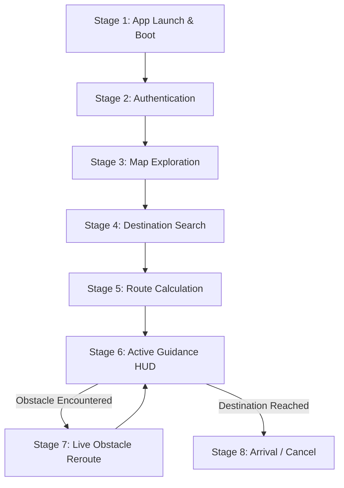

# State Management & Simulation Guide

This document explains the purpose of the desktop simulator, how to build and operate the simulation interface, the complete 8-stage user journey, and the architectural rationale behind the two-tier state machine design.

---

## 1. Simulator Purpose & Build Instructions

### What Purpose It Serves
The **Desktop Navigation Simulator** (`nav_desktop_runner`) serves to demonstrate and verify how our indoor navigation application behaves before deploying it to an Android device.

* **Shows Developers App Simulation**: Provides an interactive preview of how mobile UI actions trigger engine events, state transitions, and route calculations.
* **Emulates Mobile UI & Engine Communication**: Mimics the data exchange across the future JNI boundary between Android (Kotlin) and the native C++ engine.
* **Rapid Prototyping Without Android Overhead**: Allows team members to test floor switching, multi-floor route planning, waypoint advancement, and live obstacle rerouting without needing Android Studio, an emulator, or physical hardware.
* **Real-Time Function Call Logging**: Every state transition and event dispatch emits a traceable log (e.g. `[Call] Class::Method(...)`), giving developers instant visibility into the internal call stack.

---

### How Linking Works
`nav_desktop_runner` links directly against:
1. `nav_engine` (`libnav_engine.a`): The static native C++20 engine library containing both state managers, contexts, and polymorphic states.
2. `CliUI.cpp`: The lightweight terminal UI rendering the real-time status dashboard and 3D guidance HUD.

It compiles as a native desktop binary with **zero Android NDK dependencies**, enabling sub-second compilation and test iteration.

---

### How to Build and Run

#### Method A: In CLion (Recommended)
1. **Select Target**: In the top-right toolbar dropdown, ensure the active configuration is **`nav_desktop_runner`** (a CMake Application target, *not* a single-file runner).
2. **Build**: Press `Ctrl + F9` (or click the Hammer icon).
3. **Run**: Press `Shift + F10` (or click the Green Play icon).

> [!IMPORTANT]
> **Windows File-Lock Warning**: If `nav_desktop_runner.exe` is already running in a terminal or the CLion Run tab, Windows locks the executable file. Attempting to rebuild while it is open will cause a linker error (`cannot open output file ... Permission denied`). Always stop the running simulator (or press `0` to exit) before recompiling.

#### Method B: In Terminal / Command Prompt
```powershell
# 1. Configure CMake build cache
cmake -B cmake-build-debug

# 2. Compile and link the desktop runner target
cmake --build cmake-build-debug --target nav_desktop_runner

# 3. Execute the simulator
.\cmake-build-debug\desktop_test\nav_desktop_runner.exe
```

---

## 2. Using the Simulation Interface

When you run `nav_desktop_runner.exe`, a real-time status dashboard displays the live states of both Tier 1 and Tier 2, followed by an interactive menu:

```text
========================================================================================
 SIT BLOCK E2 INDOOR NAVIGATION -- TWO-TIER STATE MACHINE SIMULATOR
========================================================================================
 [TIER 1 APP STATE] : AuthState | User: (Not Authenticated) | Tab: MapView
 [TIER 2 CORE STATE]: ExploreState | Floor: Level 1 | Target: None
 [ACTIVE ROUTE]     : 0 Waypoint(s) | Avoid Stairs: OFF | Modals: 
========================================================================================

Choose an action:
  [1] Switch Campus Floor (Level 1 / 2 / 3)
  [2] Select Destination Room & Mobility (Trigger Route Planning)
  [3] Step Through Active Guidance HUD
  [4] Simulate Live Corridor Obstacle Report (Trigger Dynamic Reroute)
  [5] Cancel / Finish Navigation Route
  [6] Toggle Authentication / User Profile Flow
  [7] Run Full End-to-End Simulation Walkthrough (userflow.md)
  [0] Exit Simulator

Enter option [0-7]: 
```

---

### Standard Simulation Flow: Testing a Multi-Floor Route

Developers should follow these 3 primary steps to simulate an end-to-end multi-floor route:

#### Step 1: Set Your Campus Level
1. Enter `1` to select **Switch Campus Floor**.
2. Type `3` to place the user on **Level 3**.
3. **What happens**:
   * The simulator dispatches a `FLOOR_SWITCH` event.
   * `ExploreState::HandleEvent()` executes, setting `EngineContext.currentFloorId = 3`.
   * The dashboard updates to `Floor: Level 3`.

#### Step 2: Set Target Destination & Mobility
1. Enter `2` to select **Select Destination Room & Mobility**.
2. Type `203` (Room 203 is located on **Level 2**).
3. Type `y` to enable elevator-only mobility (**Avoid Stairs**).
4. **What happens**:
   * A `DESTINATION_SELECTED` event is dispatched.
   * The core engine transitions from `ExploreState` $\to$ `RoutePlanningState`.
   * `RoutePlanningState::OnEnter()` detects that the starting floor (Level 3) differs from the destination floor (Level 2).
   * Because stairs are avoided, it generates a multi-floor route via **Elevator 350 (Floor 3)** down to **Elevator 250 (Floor 2)**.
   * The engine automatically transitions to `NavigationState`, and the **3D Guidance HUD** appears:

```text
+-------------------------[ 3D GUIDANCE HUD ]--------------------------+
| Step 1 of 4 | Target: Room 203 |
|  >>> [WAYPOINT 1] Node 301 (Floor 3, Pos: 0, 0, 12) <-- YOU ARE HERE
|      [WAYPOINT 2] Node 350 (Floor 3, Pos: 8, 0, 12)
|      [WAYPOINT 3] Node 250 (Floor 2, Pos: 8, 0, 8)
|      [WAYPOINT 4] Node 203 (Floor 2, Pos: 18, 4, 8)
+----------------------------------------------------------------------+
```

#### Step 3: Move from Waypoint 1 to Waypoint 2 (and beyond)
1. Enter `3` to **Step Through Active Guidance HUD**.
2. **What happens**:
   * `NavigationState::OnUpdate()` advances the active waypoint index.
   * The cursor moves from Waypoint 1 (starting corridor) to `[WAYPOINT 2] Node 350` (Elevator entrance on Floor 3).
3. Enter `3` a second time:
   * The cursor advances to `[WAYPOINT 3] Node 250` (Elevator exit on Floor 2).
   * Notice that the dashboard automatically synchronizes: `Floor: Level 2`.
4. Enter `3` a third time:
   * The cursor arrives at `[WAYPOINT 4] Node 203` (final destination).

---

### Additional Interface Controls

* **`[4]` Simulate Corridor Obstacle Report**: Simulates tapping a blocked corridor. Transitions to `ObstacleReportState`, assigns infinite weight to the blocked edge, and returns to `NavigationState` with a dynamic detour inserted into `activeRoute`.
* **`[5]` Cancel / Finish Navigation Route**: Dispatches `CANCEL_NAVIGATION`, clears the waypoint list, and returns Tier 2 to idle `ExploreState`.
* **`[6]` Toggle Authentication Flow**: Switches Tier 1 between `AuthState` (logged out) and `MapViewState` (authenticated student session with `@sit.singaporetech.edu.sg`).
* **`[7]` Run Full Walkthrough**: Automatically executes all 8 stages from `userflow.md`, printing each function call for verification.
* **`[0]` Exit Simulator**: Cleanly shuts down the application.

---

## 3. The 8-Stage User Journey (User Actions vs. Code Execution)

The following timeline details how every user action in the mobile app maps directly to internal C++ code execution across both state tiers:



### Stage 1: App Launch & Engine Boot
* **User Action**: Taps the app icon on Android.
* **Tier 1 (App State)**: Boots into `AuthState` (displays the SIT login screen).
* **Tier 2 (Engine State)**: Starts in `BootState` (prepares 3D floor mesh caches and graph metadata), then transitions immediately to idle `ExploreState`.

### Stage 2: User Authentication
* **User Action**: Signs in using an SIT school email (`@sit.singaporetech.edu.sg`).
* **Code Flow**: Dispatches `AUTH_SUCCESS`. `AppStateManager` sets `AppContext.isAuthenticated = true` and transitions from `AuthState` $\to$ `MapViewState` (main campus view).
* **Tier 2 (Engine State)**: Remains uninterrupted in `ExploreState`, maintaining 3D buffers.

### Stage 3: Exploring the Map
* **User Action**: Drags to rotate/pan the 3D isometric view, or taps a floor button (e.g. Level 3).
* **Code Flow**: Dispatches `FLOOR_SWITCH(floor=3)`. `ExploreState::HandleEvent()` executes, updates `EngineContext.currentFloorId = 3`, and signals the renderer to display Level 3 geometry.

### Stage 4: Searching & Selecting a Destination
* **User Action**: Opens the search bar, selects **Room 203**, and toggles **"Avoid Stairs"** on.
* **Code Flow**: Dispatches `DESTINATION_SELECTED(dest=203, avoidStairs=true)`. `CoreStateManager` records the target into `EngineContext` and transitions from `ExploreState` $\to$ `RoutePlanningState`.

### Stage 5: Route Calculation
* **User Action**: Briefly observes a calculation spinner.
* **Code Flow**: Inside `RoutePlanningState::OnEnter()`, the multi-floor $A^*$ algorithm evaluates horizontal corridors and elevator shafts (pruning stairs), computes 3D waypoints, stores them into `EngineContext.activeRoute`, and transitions to `NavigationState`.

### Stage 6: Active Guidance HUD
* **User Action**: Follows the 3D route ribbon and turn-by-turn guidance HUD.
* **Code Flow**: `NavigationState::OnUpdate()` monitors location/waypoint updates. As the user walks, `currentWaypointIndex_` advances through `activeRoute` and updates `EngineContext.currentFloorId`.

### Stage 7: Obstacle Encounter & Dynamic Rerouting
* **User Action**: Walks toward a blocked corridor (e.g. wet floor / construction) and taps the corridor on screen.
* **Code Flow**:
  1. The engine transitions from `NavigationState` $\to$ `ObstacleReportState`.
  2. The tapped corridor edge is assigned an infinite cost ($\infty$).
  3. The engine transitions back to `NavigationState`, which immediately triggers $A^*$ path recalculation around the blockage.

### Stage 8: Arrival or Cancellation
* **User Action**: Reaches Room 203 or taps "Cancel Route".
* **Code Flow**: Dispatches `CANCEL_NAVIGATION`. `NavigationState::OnExit()` clears `EngineContext.activeRoute` and transitions the engine back to idle `ExploreState`.

---

## 4. Standard Lifecycle Methods

Every state across both managers implements the exact same 4 polymorphic lifecycle hooks:

| Lifecycle Hook | Role & Invocation |
| :--- | :--- |
| **`OnEnter(context)`** | Executed once upon entering the state. Initializes state-specific resources or triggers automated transitions. |
| **`OnUpdate(context, deltaTime)`** | Executed on every frame/tick loop to advance continuous logic (e.g. sensor polling, guidance tracking). |
| **`OnExit(context)`** | Executed once when transitioning out of the state. Cleans up transient overlays or temporary allocations. |
| **`HandleEvent(context, event)`** | Receives asynchronous inputs (button clicks, floor selections, corridor taps, auth callbacks). |

---

## 5. Why Two State Managers?

In a hybrid mobile application combining a native Android UI with an OpenGL 3D engine, running a single monolithic state manager causes major architectural conflicts:

* **Mobile UI Lifecycle**: Involves rapid, frequent transitions (switching bottom tabs, opening search drawers, popping modal sheets, pausing/resuming activities).
* **3D Engine Lifecycle**: Involves heavy GPU memory allocations (loading 3D floor meshes into vertex buffers, keeping navigation graph adjacency lists in RAM) that must persist continuously.

To resolve this conflict, state management is separated into **Two Tiers**:

```text
+-----------------------------------------------------------------------------------------+
| Tier 1: AppStateManager (UI & Android App Flow)                                         |
| Handles login screens, bottom navigation tabs, search drawers, and modal dialogs.       |
| Uses: AppContext (stores user email, auth status, active tab, modal visibility flags).  |
+-----------------------------------------------------------------------------------------+
                                             │
                                             ▼ (JNI Boundary)
+-----------------------------------------------------------------------------------------+
| Tier 2: CoreStateManager (3D Engine & Pathfinding)                                      |
| Coordinates 3D camera, multi-floor A* pathfinding, guidance HUD, and obstacle rerouting.|
| Uses: EngineContext (stores 3D map graph, active route waypoints, current floor ID).   |
+-----------------------------------------------------------------------------------------+
```

### Key Architectural Advantage: Non-Destructive Memory
In traditional single-tier state machines (such as simple game FSMs), transitioning to a new state tears down and reloads memory. 

In our two-tier architecture:
1. **Contexts Persist Continuously**: `EngineContext` and `AppContext` remain allocated in memory across all state changes.
2. **Decoupled UI Operations**: Switching tabs (e.g. from Map to User Profile) or opening an obstacle report modal **never destroys or unloads the 3D map geometry or active navigation route**.
3. **Android Lifecycle Resilience**: When Android pauses or recreates the activity, the native C++ engine state remains intact.
