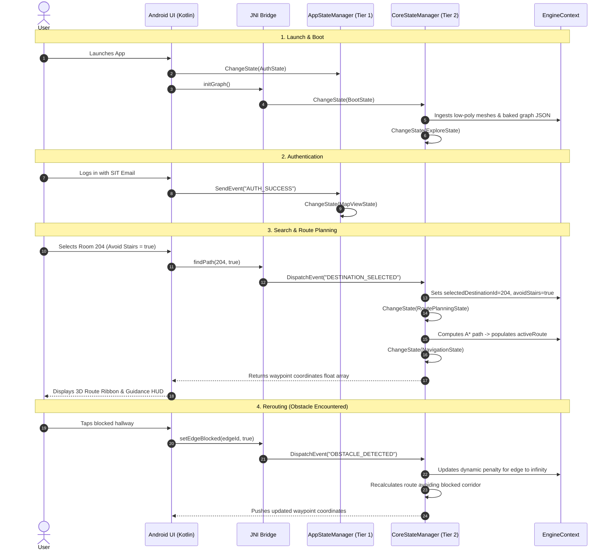

# State Manager: User & Code Timeline Guide

> **5-Minute Onboarding**: How user actions drive the Two-Tier State Machine across Android UI and the Native C++ Engine.

---

## 1. The 30-Second Architecture Mental Model

The navigation system divides state responsibilities into two distinct tiers:

```text
+-----------------------------------------------------------------------------------------+
| Tier 1: UI / Application State Manager (AppStateManager)                                |
| Handles Android activity lifecycles, bottom tabs, authentication, and overlay drawers.  |
+-----------------------------------------------------------------------------------------+
                                             │
                                             ▼ (JNI Boundary)
+-----------------------------------------------------------------------------------------+
| Tier 2: Core Engine State Manager (CoreStateManager)                                    |
| Coordinates 3D camera, OpenGL geometry, multi-floor A* pathfinding, and guidance HUD.   |
+-----------------------------------------------------------------------------------------+
```

* **No Destructive Reloads**: Data buffers (`EngineContext` and `AppContext`) persist in memory. Transitioning states never wipes the loaded 3D meshes or graph topology.
* **Polymorphic Lifecycle**: Every state implements standard lifecycle hooks: `OnEnter()`, `OnUpdate(deltaTime)`, `OnExit()`, and `HandleEvent()`.

---

## 2. End-to-End Timeline: User Action vs. Code Execution

| Stage | User Timeline (What User Sees & Does) | Tier 1: App State (`AppStateManager`) | JNI / Event Boundary | Tier 2: Engine State (`CoreStateManager`) | Context Changes |
| :--- | :--- | :--- | :--- | :--- | :--- |
| **1. App Launch** | User taps the app icon on Android. | Initializes in `AuthState`. | `MainActivity.onCreate()` initializes engine. | Initializes in `BootState`, loads meshes & graph, switches to `ExploreState`. | `EngineContext.graph` parsed; `currentFloorId = 1`. |
| **2. Auth** | User signs in via Google / SIT school email. | `AuthState` receives `AUTH_SUCCESS` -> switches to `MapViewState`. | N/A | Stays in `ExploreState` (rendering idle 3D campus). | `AppContext.isAuthenticated = true`; `userEmail` saved. |
| **3. Explore Map** | User drags to pan/orbit camera, taps floor switcher (e.g. Level 2). | `MapViewState` active. | `NativeEngine.setFloor(2)` -> `FLOOR_SWITCH` event. | `ExploreState::HandleEvent()` updates camera target & visible floor mesh. | `EngineContext.currentFloorId = 2`. |
| **4. Search & Select** | User opens search drawer, selects Room 204, toggles "Avoid Stairs". | `MapViewState` search modal active. | `NativeEngine.findPath(204, avoidStairs=true)` | `ExploreState` receives `DESTINATION_SELECTED`, triggers `ChangeState(RoutePlanning)`. | `EngineContext.selectedDestinationId = 204`; `avoidStairs = true`. |
| **5. Route Calculation** | User sees brief route loading overlay. | `MapViewState` shows route preview card. | N/A | `RoutePlanningState::OnEnter()` runs multi-floor $A^*$, populates waypoints, switches to `NavigationState`. | `EngineContext.activeRoute` populated with calculated 3D waypoints. |
| **6. Active Guidance** | User walks; HUD displays turn-by-turn guidance and 3D path ribbon. | `MapViewState` displays guidance HUD banner. | Sensor/location updates forwarded via JNI. | `NavigationState::OnUpdate()` monitors user progress along active waypoints. | `currentWaypointIndex_` advances. |
| **7. Obstacle Report** | User spots blocked hallway, taps corridor to report blockage. | Opens Obstacle Report bottom sheet. | `NativeEngine.reportObstacle(edgeId)` | Transitions to `ObstacleReportState`, formats alert payload, returns to `NavigationState` with reroute. | Target edge weight set to $\infty$; active route recalculated. |
| **8. Finish / Cancel** | User arrives at destination or taps "Cancel Route". | `MapViewState` closes guidance HUD. | `NativeEngine.cancelRoute()` | `NavigationState` handles `CANCEL_NAVIGATION` -> transitions back to `ExploreState`. | `EngineContext.activeRoute.clear()`. |

---

## 3. Visual Sequence Diagram



---

## 4. Code Execution Quick-Reference

### How Events Flow Across the Boundary

```cpp
// Simulated Android UI Event in C++ (desktop_test/main.cpp)
StateManager engine;

// 1. Transition core engine to explore view
engine.ChangeState(StateType::Explore);

// 2. User selects destination in UI -> dispatched via event
AppEvent selectDestEvent;
selectDestEvent.type = "DESTINATION_SELECTED";
selectDestEvent.payloadInt = 204;
selectDestEvent.payloadBool = true; // Wheelchair / avoid stairs
engine.SendEvent(selectDestEvent);

// 3. State machine transitions to planning & computes route
engine.ChangeState(StateType::RoutePlanning);

// 4. Tick loop advances active state logic
engine.Update(0.016f);
```

---

## 5. Developer Cheat Sheet: Adding a New State in 3 Steps

To add a new state (e.g. `CalibrationState`):

1. **Add Enum**: In `ICoreState.h`, add `Calibration` to `enum class CoreStateType`.
2. **Implement State**: Create `CalibrationState.h` and `CalibrationState.cpp`:
   ```cpp
   #pragma once
   #include "state/ICoreState.h"

   class CalibrationState : public ICoreState {
   public:
       void OnEnter(EngineContext& context) override;
       void OnUpdate(EngineContext& context, float deltaTime) override;
       void OnExit(EngineContext& context) override;
       void HandleEvent(EngineContext& context, const EngineEvent& event) override;
       CoreStateType GetType() const override { return CoreStateType::Calibration; }
   };
   ```
3. **Register in Manager**: In `CoreStateManager.cpp`, add the case to `CreateState()`:
   ```cpp
   case CoreStateType::Calibration:
       return std::make_unique<CalibrationState>();
   ```
